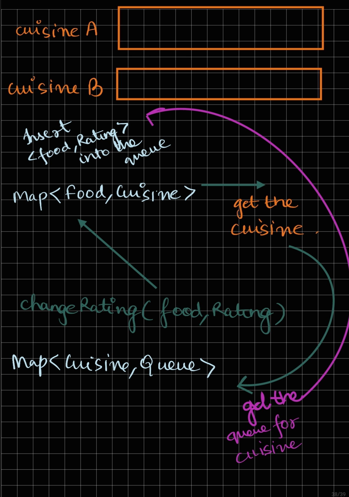

### `PROBLEM SOLVING INTUITION`

[LeetCode Link ](https://leetcode.com/problems/design-a-food-rating-system/description/)

* Problem involves asking us to get the highest rated food everytime so the obvious choice is Heaps
* Maintain a queue for every cuisine so that when the highest rated food for that  cuisine is requested we can leverage the queue
* Point to be noted is when ratings change the entry that we have done earlier in the queue is no longer required hence maintain a Map<Food,Rating> which keeps the current highest rating for the food and when the one which we pull from the queue does not match this rating we disregard the ans
* Maintain a Map<Food,Cuisine> to get the cuisine when the update to food is requested.

### `METHODS`

* void changeRating(String food, int newRating) Changes the rating of the food item with the name food.
* String highestRated(String cuisine) Returns the name of the food item that has the highest rating for the given type of cuisine. If there is a tie, return the item with the lexicographically smaller name.

